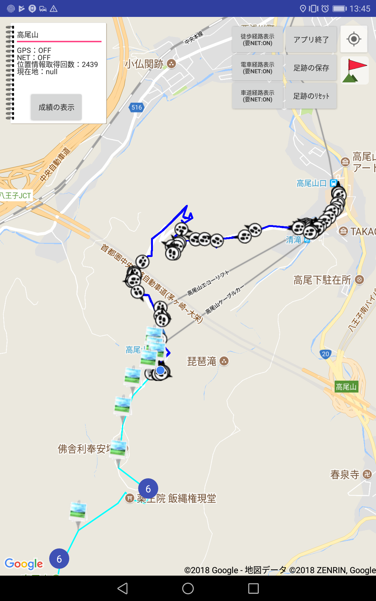
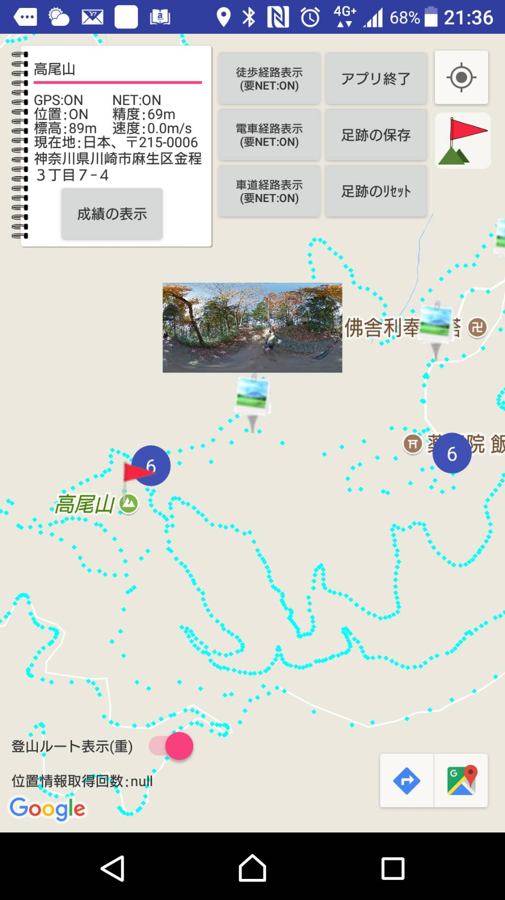
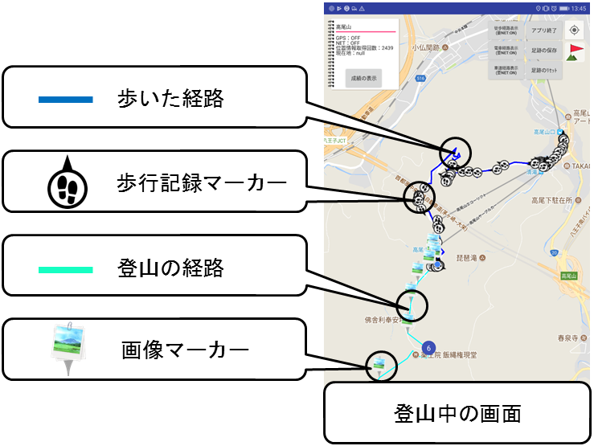
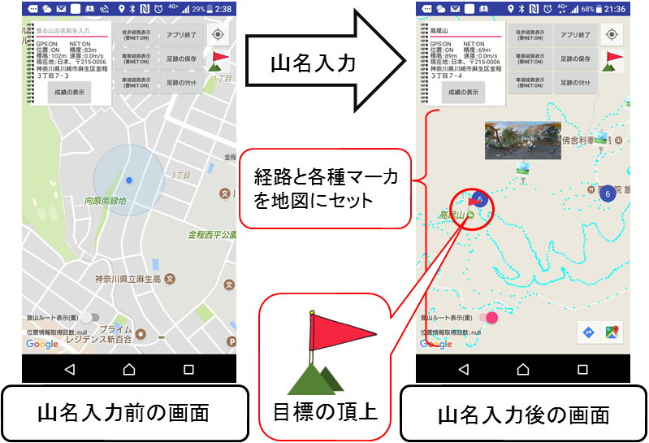

# ResearchMountainMap
大学の卒業研究で作ったマップアプリ。登る山の名称を入力したら、頂上までのルートや風景画像、歩いたルート、現在地の地名などを表示してくれます。
対応OS　は　Android 6.0/6.0.1 Marshmallow　以上を対象としています。
2018年1月１０日：データセットを「高尾山」しか入れていないため、頂上までのルート表示は「高尾山」でのみ使えます。

##起動準備
git clone したら　androidstudio　で開いてください。
アプリの使用するには Google API キー　が必要です。キーの取得方法については(Google Maps API キーの取得)[https://developers.google.com/maps/documentation/android-api/signup?hl=ja]の記事を参考にしてください。
取得した Google API キーを res/values/google_maps_api.xml 内の 「xxx」 に差し込んでください。

```
<string name="google_maps_key" templateMergeStrategy="preserve" translatable="false">xxx</string>
```

##使い方
アプリを起動したら登る山の名称を入力し、地図としてお使いください。


